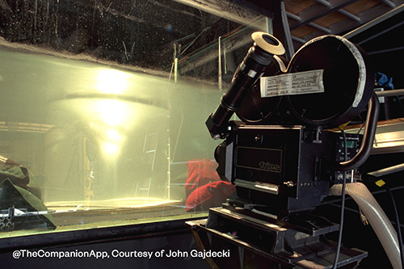

# VRChat Stargate Project


Thanks for checking out my Stargate prop project! This was made as a learning exercise in VRChat/Udon/Shader development. 

If you're unfamiliar, the Stargate is a device from the 1994 sci-fi movie of the same name, and its many follow-up shows and movies: Stargate SG1, Stargate: Atlantis, Stargate: Universe, etc. In the show, it is an alien artifact left on thousands of habitable planets throughout the galaxy (the majority of which look like Vancouver) that can connect to each other via a wormhole, if the correct destination address is dialed. Its behavior is remarkably consistent throughout the various episodes and shows, making it a great subject to replicate.


I have seen many implementations of Stargates in various games, dating back to the excellent content in Garry's Mod, but there have always been a few bits of their implementations that bothered me. The startup sequence (the "kawoosh") always looks kinda cheesy in realtime engines. Any that implement teleporting tend to make the traveler disappear immediately and don't have any satisfactory "interior" to the wormhole (since they're just ... teleporting). The surface of the puddle never holds up to close inspection, since it's usually done by playing a low-res animation scraped from the TV show on a flat plane. I wanted to fix those issues and make a Stargate that was as close to a canonical "experience" as I could, and also had some practical use in-game.

In addition to using this as a Stargate to teleport around your worlds, there is some spinoff functionality that could be applied to other projects:
* Simple realtime interactive ripples
* Smooth teleporting via a buffer zone (the pocket)
* Splashy water particles that look good in realistic lighting

## Demo world

https://vrchat.com/home/content/worlds/wrld_8f59fd67-59c2-4e96-84a3-3527af9f4bbd

## Contents of this Repo

This is still a work in progress, and I have plans to clean up these assets a lot! But I wanted to get the code out in front of people, if not drag-and-drop prefabs, as soon as I could.

### Props

Contains the raw blender model of the Stargate, fbx exports, the necessary textures, and the platform model. I made this from scratch from reference photos from the show, and from [closeup pictures of the actual prop](https://www.youtube.com/watch?v=fFY720eozwU) taken when it was all auctioned off. Glyphs for the gate are from https://stargate.fandom.com/wiki/Glyph. Free to use however you'd like!

I did not include the DHD (Dial-home device) model I use in my demo world, as that is from Carter's Addon Pack for GMod. (As are many of the sound effects.) It is freely available, but I'd rather not redistribute. You can make any button you'd like into a DHD using my included script.


### Code

Here are all the straight U# scripts used to implement the Stargate. I've tried to keep them well documented. They will be referenced in the "How everything works" section below, but their general purpose is:

- DepthCameraRange.cs
  - This is a simple utility script to only run the stargate's camera (for creating ripples in the puddle, see: The surface of the gate) when they are within a given collider. This lets you limit the performance impact to people close enough to appreciate the effect. I found that past 50m, it was impossible to see anyway.
- GateButton.cs
  - Script that makes an object into a DHD. Simply calls ToggleLocalGate() on the Stargate it is attached to. In the future, might use parameters here to choose which gate it connects to, allowing you to dial elsewhere.
- GateController.cs
  - The main implementation of the gate's behavior. It does intra-world teleport for players and objects (See: Transport through the gate), inter-world teleport (via the hack, see Intercepting the VRC Portal), sound effects, animation, and network synchronization.
- TouchPocket.cs
  - script running on the pocket/buffer area to tell the gate controller when something/someone is passing through.
- TouchPuddle.cs
  - script that runs on the puddle, to tell the gate controller when things are touching that.

## How to use the prefab

Link to prefab: https://drive.google.com/file/d/1v2M-M33ugmYdGfaRrUwHtf05Lv00YUf3/view?usp=share_link

I am including a prefab of the Stargate itself that should be sufficient to use it in any world. I'm still working on improving the usability, and at the moment it's quite messy; for now there's a lot of wiring you have to do to get stargates and DHDs connected, and the package itself is not the most organized. But if you'd like to use it as-is:

- Have a VRC World with Udon# installed.
- Import the prefab.
- place at least one instance of the Stargate in your world.


- The root of this object contains the GateControl script, from which you must configure a few things.
    - You must set the Destination field. Destination can be any transform, such as an empty; if you only have one stargate, it can teleport people and objects to any arbitrary point. If you do use a second gate, drag its TransportCommon object into the Destination field.
    - If you are using a second stargate, also drag that second GateController into the TargetLocalGate of the first gate. It will now function correctly activating when dialed. To be able to go back, the second gate must be configured to point to the first gate in the same way.
    - You must set the LocalBack to the TransportCommon gameobject inside the prefab. This was just an oversight on my part. The LocalBack is what remains consistent when teleporting between two Gates, to make the transit appear smooth.
- Create a dialing device.
    - The simplest way to do this is to make an object that uses the provided GateButton.cs script. You can even do this to the stargate or the platform. That script requires that you set on it which Gate it controls, and a sound to play for clicking.
    - Any other script that can call ToggleLocalGate() on the stargate will suffice.

You now should be able to activate the gate, and come out at your destination, along with seeing all the ripples and effects.

Adding a second (or any additional) gate(s) has one catch, and that is that each gate requires a few unique rendertextures and materials. The unique items for this gate are stored in the GateA_Tex folder. We have:
- GateDepthTex, which is the texture that our puddle camera renders into to see when objects are crossing
- GateDisplacementTex, which contains the current height of the ripples on the surface. A custom rendertexture, the material for which is GateDisplacementMat.
- GateAppearance, the material that renders the surface. It takes the unique displacement texture.
- GateBack, renders the transparent backside of the gate. Takes the displacement texture.
- GateDisplacementMat, renders the ripple effect into the rendertexture based on its previous state, and the camera. Requires the depth texture.

These texture/material assets must be duplicated for each gate, and assigned appropriately. The `eh` mesh gets the GateAppearance material applied, and the `eh-back` gets GateBack applied. The DepthCamera gets assigned GateDepthTex as its target.

## How everything works

Explanations! For the curious, or if you want to implement something similar yourself.

### The "Kawoosh" particles

When the stargate opens, it is accompanied by a dramatic visual effect, the Kawoosh. In the show, this was originally done by blasting an air canon down into a tank of water, and filming the bubbles against a bluescreen. Eventually this was replaced by a CG model, but the original footage makes appearances in every series.




In order to replicate this effect, many implementations have tried a particle based system - which often looks bad because it lacks detail and definition in the blast - or a straight deformation of the ripple, which looks bad because it doesn't have the chaos and detail of the real bubbles.

I decided to implement this using particles, but rendered with a shader that makes them look much more grounded in the world, and includes some of the nuance of the original footage.


Each billboard in the kawoosh particle system is rendered using a shader (Bubble.shader) that draws a splash of water, using a normal map to sample the environment to provide contextual fresnel reflections. (It's very approximate, but it's moving so fast that it doesn't matter.)

The shader has a few parameters; one of which, _Transition (or alternatively the uv z coordinate), smoothly transitions the normal map from a very chaotic, frothy bubble, to a smooth one. This is randomly animated over time for the particles. This gives the effect of the texture of the vortex changing, as air bubbles join up and merge. This provides a substantial amount of realism to the effect.


Another effect is that the particles are tinted with fake lighting, to be brighter from above. This gives the whole effect a much more substantial 3d feeling, leading to the feeling that this is a column of solid, violent water.

There is also a parameter for Glow, to cause the whole thing to light up, and this is animated along with the similar glow of the puddle. Makes it a bit more dynamic.

The particles are guided by some force fields, and are destroyed when they fall back into the puddle. This results in some visual noise right at the threshold of the puddle, so to cover that up, I use a lens flare that whites out everything that's going on at the threshold when it's most relevant. This also adds to the *drama* of the gate opening - it's supposed to feel powerful and overwhelming, and a great way to do that in VR is to make it look briefly impossibly bright. This may or may not be canon, but it gets the right response.

### The surface of the gate

The basic explanation behind how the rippling surface of the puddle works is:
1. Camera renders an orthographic view of the area immediately around the puddle to a texture that only stores depth.
2. A Custom Render Texture takes that depth as input, as well as its own previous texture, and renders out a new texture using a wave simulation. The output of this texture is the current (and previous frame's) height of the ripples.
3. A regular material samples this texture and applies it to the puddle mesh, which deforms slightly with a vertex shader and otherwise renders the visual effects of the ripple height using a few basic tricks to match the show.

Here's a breakdown of those shaders.

#### The ripple simulation

This is implemented by the GateDisplacementMat material, and the GateSurface shader. There are a few parameters to the material:


Gradient is an input to the wave equation that is theoretically a function of properties of the material and your timestep. In practice, if you aren't simulating a specific fluid, you can tune it to get the desired viscosity you want. It must be (0 < x < 0.5) for a stable simulation.

Damping reduces the effects of waves over time; otherwise any disturbance would ripple and reflect of the edges forever, which is not what we want in most cases. 1 is no damping. A value very close to 1 works well.

Noise Mag controls how much random noise (given by the noise texture - it cycles through hues over time) gets added to the height. This is a way of setting up non-physically-motivated ripples in the surface. I created a noise texture that results in an effect that looks good on the scale of the Stargate, but it could be anything. (Or nothing!)

Impact Mag controls how much the depth texture from the camera should affect the surface. Higher values here mean bigger ripples when something enters the camera's field of view.


The actual ripple equation is relatively straighforward, once you read through all the theory.

```
// calculate the new displacement
float z = _A * (
tex2D(_SelfTexture2D, uv + float2(px,0)).x +
tex2D(_SelfTexture2D, uv - float2(px,0)).x +
tex2D(_SelfTexture2D, uv + float2(0,px)).x +
tex2D(_SelfTexture2D, uv - float2(0,px)).x) +
(2.0 - 4.0 * _A) * prev.r -
(prev.g);
```

We sample the four cardinal directions, one pixel away - which gives us the height that our neighbors are forcing us to - times our current height (red channel), minus our previous height (green channel). This factors in our pixel's current "speed", if it's going up or down. The result of this is the predicted next height.

A final note is that we use a mask texture to force certain parts of the output to zero. This effectively sets boundary conditions for the wave sim, so that you don't see obvious waves reflecting off of the flat sides of the texture, but instead they can be smoothly or sharply damped at any point, to mimic any other wall to the container. In the stargate and the pool, the circular aperture can result in some nice standing waves.

#### The appearance

The puddle's surface is controlled by the GateAppearance shader. It samples the heightmap calculated in the previous step, and renders the puddle. (The rendering is controlled by many parameters, some of which are used to adjust the aesthetics, while others are animated during the opening/closing of the gate.)

The first step is a vertex shader that slightly offsets the surface according to the heightmap.

In the pixel shader, we first calcualte the normal by sampling the heightmap. Then, using that normal, we sample a texture of the glowing light source inside the stargate. We sample it as if it were on a plane a fixed distance behind the gate; essentially seeing how far the refracted vector would go, given the normal. (That distance is a parameter.) We then apply some color tints, and modifications to make it glow or disappear for the various animation stages, and we're all set.

Here is an illustration of this appearance shader. First it renders with no normal map and zero distance from the "light" texture. It's as if it's rendered flat. Then we increase the distance, which makes it appear to sink back into the surface. Then we apply a distortion with the normal map. Finally, we see that you can use whatever texture you want.


#### A regular pool of water

I have also implemented this all for a regular non-scifi application, a simple pool of interactable water. This is in PoolAppearance.shader, and instead of doing the stargate lighting effect, it uses the heightmap to render the surface of some water, with reflections and refractions on a grabpass depending on the angle of incidence, like, you know, water. Basically, please apply this depth camera + wave simulation to any surface that you can align with the camera!


### Transport through the gate (the buffer zone)

The Stargate has to live up to its name and actually teleport people and things around the map. I did not want to implement the common pattern of a collider teleport, since then onlookers wouldn't see the person or object fully step through the puddle before they vanished. So I had to come up with a way to teleport people only after they were entirely through. Since they were stepping through the gate, then, that implies that they could see out the other side! That wouldn't make much sense, to step out the back only to be snapped to the destination a moment later. So, to resolve this, I again took reference from the show. What does it look like on the inside of a stargate?

Once in the original feature film, and again in the movie Stargate: Ark of Truth, they show that once you pass through the gate you exist for a moment in a bright, underwater sort of environment. Then you fly apart into atoms - in which I assume you don't percieve anything - and then are reconstructed on the opposite side. They often speak in the show of the gate's "buffer" as a kind of pocket dimension.


So how does one get this to work in VRChat? I borrow the concept of a buffer. When you are not touching the gate, all you see is the surface, the puddle. But once you touch the puddle, on the opposite side of the gate, an otherwise hidden buffer zone - one meter thick - appears. Its faces face internally, and are unshaded and brightly lit so there's no way to tell how far it extends on the inside. If you stick your head in, you might as well be in an infinite void. (This is implemented by TransitSpace.shader).


This buffer disappears if you then pull yourself out of the puddle's collider. So there's no practical way to see it from the back, only if you stick your head through the front. This is kept track of by the GateController script.

Once you step through completely, you stop contacting the puddle surface, but remain contacting the buffer. This tells the controller that you have in fact stepped through the front, and are ready to teleport. The gate's destination is either a random point, or an identical location inside another gate's buffer zone. Either way, it calculates your offset from the local TransportCommon point and the destination, and teleports the player or object that has transited to the equivelant relative location, to provide a smooth teleport experience. (If the destination is another gate, and a player is transiting, the source gate "calls ahead" and turns on the buffer zone graphics at the destination, so there's no flicker or anything when the transport occurs. To the player, the view is identical on both sides.)

The destination gate, if one, is informed that the player/object is transiting and will not attempt to transit them back through the opposite direction. They simply step through (or in the case of objects, get some extra velocity applied to help clear the gap) and exit the other gate through the front of the buffer zone, and out through the surface.

### Intercepting the VRC Portal

One of the cool things I showed off in the Community Meetup was that the Stargate can intercept VRC world portals, and become the portal itself. This is accomplished in a way that isn't officially supported - it relies on implementation details internal to VRC - so I don't want to share the code outright, since there's no guarantee it will continue to work. 

But the general idea is that, at least as of today, VRChat portals have colliders that can register collisions with your objects and triggers. In doing so, you can get a reference to the GameObject that represents the portal, and move / resize / alter the apperance of it however you wish. In this implementation, if the portal is dropped within a range of the gate, it will move it to take up the buffer area inside the gate, hide all the graphics, and then trigger the gate to appear to open (though it won't try and transport you itself, you just run into the portal.) I don't recommend actually hiding the destination of the portal, as it's probably uncool to surprise people with world portals they can't see, but I did that for the community meetup, because it was funny.

## Errata

### Things that aren't canon:

#### This stargate can't kill you. 
In the show, any of the following will result in you being vaporized, literally leaving a pair of smoking boots:
- Going through a gate from the destination side
- Entering a gate from the back
- Being inside the gate when it shuts down
- Being in the path of the Kawoosh

I chose not to implement any of these because, how do you even deal with that in VRC? If you're making a Stargate Game or something I can see it being relevant, and wouldn't be too hard to do, but I haven't bothered yet. Might be an option on the prefab in the future.


#### This stargate goes both ways.
In the show, you can only go through a gate one-way, from the dialing planet to the destination planet. In this implementation I allow two-way travel, simply because for the VRC Community Meetup it was easier. I didn't want people to worry about which gate was dialed out from vs in from.

#### There's no address dialing.
Not *yet*!

### Bugs & Future Work

- I need to clean up the prefab, a lot, to make it easier to drop into the world.
- I want to make similar prefabs for water surfaces, for non-themed buffer teleports, etc.
- The water particle isn't always getting the correct reflection/refraction angle for the skybox, due to the particle's rotation. Need to figure out why that's not working.
- If you were watching behind the stargate as someone transits, you'd see them step completely through, then vanish. From their perspective they are in the buffer zone, but from yours, they're simply standing behind the gate (maybe in the air). The only way to solve this would be some kind of world space stenciling/clipping of the transiting object, and I haven't figured that out yet.
- ...?
